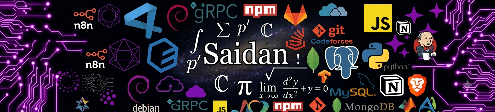

 
 

<blockquote>
  
<em>“Eres fuego en invierno”</em>

  
<b>— @xSaidanMka</b>

</blockquote>

  

  

	

> [!IMPORTANT]
> ## _**About Me**_
> - **AI Engineering** @ ESCOM, IPN · 🇲🇽  🎓
> - I am currently an Artificial Intelligence Engineering student 👨‍🎓
> - Building **Armonik** — AI Automation ⚙️ 
> - Freelancing → Agency → Startup 📈 
> - I aim to help others by solving everyday problems through AI implementations 👨‍💻
> - I'm also developing communication and sales skills 🚀
> - Welcome to my **GitHub** ✨

<b> _**Contact 💻**_</b>

<b> _**Tech Stack 🛠️**_</b>

<b> _**Relevant Projects**_</b>

 -> Coming soon...
<!--  

 
-->

<b> _**CV**_</b>
- English: [CV_Adan_ArteagaENG.pdf](https://github.com/Saidan1314/Saidan1314/releases/download/v1.0/CV_Adan_Arteaga.ENG.pdf)
- Español: [CV_Adan_ArteagaESP.pdf](https://github.com/Saidan1314/Saidan1314/releases/download/v1.0/CV_Adan_Arteaga.ESP.pdf)

 
  

 
 

   
   
  
  

---
> [!Note]
> Powered by the best: **twscraft** from UAEH ICBI | GameDev: 

Last Edited on: 20/06/2026
